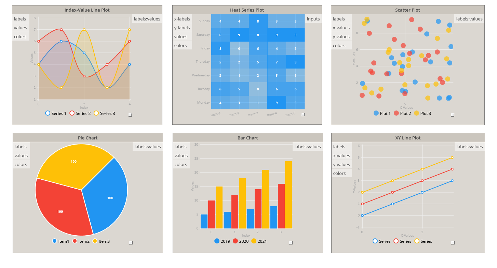
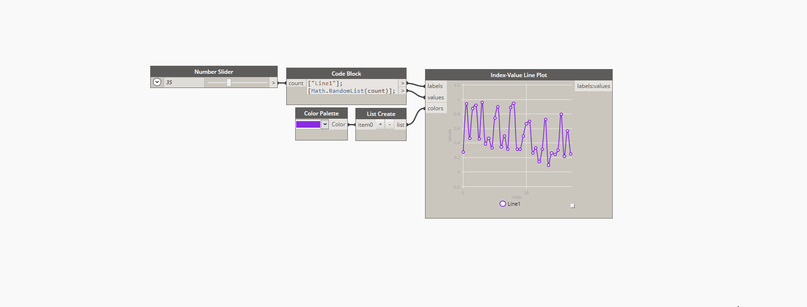

# NodeModelCharts
A collection of custom UI graphing utility nodes for [Dynamo](https://github.com/DynamoDS/Dynamo),  assisting users to visualize data on-the-go in the graph without the need for external files, windows, or images.  This library leverages the open-source [Live Charts API](https://github.com/Live-Charts/Live-Charts) to display charts on Dynamo [NodeModel](https://github.com/DynamoDS/Dynamo/blob/8afcde02f859f5dd4f261d21edb32e2b94e9450a/src/DynamoCore/Graph/Nodes/NodeModel.cs) derived nodes using [WPF](https://en.wikipedia.org/wiki/Windows_Presentation_Foundation).

## Current Nodes
- Pie Chart
- Bar Chart
- Index-Value Line Plot
- XY Line Plot
- Scatter Plot
- Heat Map Plot

## Supported Versions

NodeModelCharts is built against Dynamo 2.02+

## Installing
The easiest way to use NodeModelCharts is to download the prebuilt package on the Dynamo package manager.  If you would like to build from source you can additionally modify and uncomment [these lines](https://github.com/alfarok/NodeModelCharts/blob/master/NodeModelCharts/NodeModelCharts.csproj#L211) to automatically copy each Visual Studio build into your local Core packages folder.  One last option is to grab a prebuilt version of the package from the GitHub releases and place this folder in your packages destination (coming soon).

## Exporting Images
All `NodeModelChart` nodes have additional options in their context menu (right-click on node), one of which is `Export Chart as Image`.  This option will export a Png image of the chart at the current aspect ratio and state (excluding the `NodeView`).  For higher quality images, simply resize the node by dragging the box in the lower right-hand corner and export again.

## Performance Tricks & Customization

The goal in creating this initial library was to keep the nodes as simple as possible for the average Dynamo user.  Creating nodes with a large number of input parameters often leads to greater confusion and lower adoption rates.  Luckily, this is an open source project that wraps another open source graphing library so developers have the ability to expose and customize as much or as little as desired to fit their needs.

If you need to plot large amounts of data (thousands of points) you will begin to see a degradation of performance.  There are several simple things that can be done to greatly increase performance capabilities.  In the future some of these options can be added to the context menu to allow for simply toggling.  All of these features were left enabled to show developers the capabilities of the library.

- Turn off animations
- Turn off point rendering (line plots)
- Reduce the number shapes in your chart (`Series.DataLabels`)
- Keep the number of visual elements, sections and axes lower than 25
- When possible, disable hovering, use a null tooltip and remove any `DataClick` event from your chart
- When you are sure your strokes, fills or `PointGeometries` are not going to change then freeze them
- Avoid calling `.Add()` multiple times on a `Series`, instead use `.AddRange()` method to add a collection
- Use the [Geared package](https://lvcharts.net/licensing/pricing) add-on (The geared package is a set of light weight series that connects with this library, it allows your charts to have **millions of points**, and keep your UI responsive)

## Contributions

This package is distributed under the MIT license as is LiveCharts.  Feel free to fork and make pull requests keeping in mind that this library is intended to serve as an example to what is possible and is by no means exhaustive.  Issues can be reported on GitHub [here](https://github.com/alfarok/NodeModelCharts/issues).